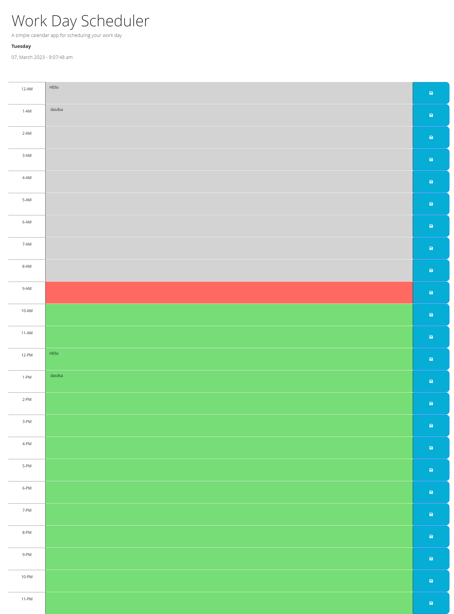

# AdHocJobHitlist

` Repo Url: ` https://github.com/dexit/AdHocJobHitlist

`Live Deployed Url:` https://dexit.github.io/AdHocJobHitlist/

This code is a JavaScript program that creates a daily planner with time slots for each hour of the day. It utilizes the jQuery library and the dayjs library to format and display the current day and time.

The program begins by creating an array called "hours" that contains strings representing each hour of the day in AM/PM format.

The "updateTime" function is then defined to update the text of an element with the ID "currentDay" to the full day name of the current date and time using the dayjs library. The function is then called to initially set the text.

The "timestampedBonus" function is defined to update the text of an element with the ID "currentTimesTamp" to the current date and time in the format "DD, MMMM YYYY - h:mm:ss a" using the dayjs library. The function is then called every second using the setInterval function.

Two external functions, "getNextUntil" and "getPreviousUntil", are then defined to select all sibling elements of an element until a specified selector is found using vanilla JavaScript.

The program then loops through each hour in the "hours" array and generates HTML for a time slot using the current hour value and the local storage of any saved tasks. The HTML is then appended to the page.

If the current hour is equal to the looped hour, the time slot is given a class of "present". The program then utilizes the "getNextUntil" and "getPreviousUntil" functions to add classes of "past" and "future" to the appropriate time slots based on their relationship to the "present" time slot.

Finally, event listeners are added to each save button in the time slots to save any entered tasks to the local storage.

